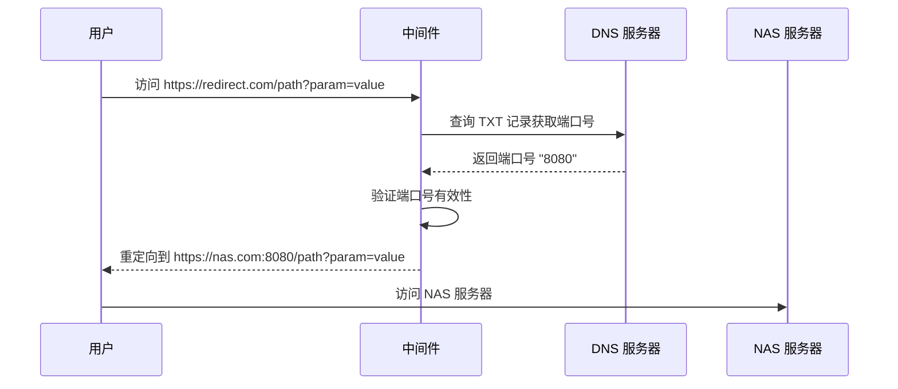

# 智能 NAS 重定向服务

一个基于 Next.js 的智能中间件项目，通过 DNS TXT 记录动态获取端口号，实现灵活的 NAS 服务器重定向。适用于动态端口环境下的 NAS 访问管理。

## ✨ 功能特性

- 🔄 **动态端口解析**：通过 DNS TXT 记录实时获取最新端口号
- ⚡ **智能缓存机制**：可配置的 DNS 查询缓存，提升响应速度
- 🛡️ **完善错误处理**：优雅的错误处理和美观的 404 页面
- 🔧 **灵活环境配置**：支持环境变量配置，便于不同环境部署
- ⏱️ **超时控制**：可配置的 DNS 查询超时时间
- 🌐 **完整路径传递**：保持原始 URL 的路径和查询参数

## 🎯 适用场景

- 家庭 NAS 服务器动态端口访问
- 企业内网服务动态端口管理
- 云服务器端口转发
- 开发环境服务动态路由

## 📁 项目结构

```
├── app/
│   ├── layout.tsx          # 根布局组件
│   └── page.tsx           # 首页组件
├── middleware.ts          # 核心重定向中间件
├── package.json          # 项目依赖配置
├── tsconfig.json         # TypeScript 配置
├── next.config.js        # Next.js 配置
├── .env.example          # 环境变量模板
├── vercel.json           # Vercel 部署配置
└── README.md            # 项目文档
```

## 🚀 快速开始

### 前置要求

- Node.js 18.0.0 或更高版本
- npm 或 yarn 包管理器
- 一个可以设置 DNS TXT 记录的域名

### 1. 克隆项目

```bash
git clone <repository-url>
cd smart-nas-redirect
```

### 2. 安装依赖

```bash
npm install
# 或者使用 yarn
yarn install
```

### 3. 配置环境变量

复制环境变量模板：

```bash
cp .env.example .env.local
```

编辑 `.env.local` 文件，配置你的参数：

```env
# 你的 NAS 服务器域名
NAS_DOMAIN=your-nas-domain.com

# 用于存储端口号的 TXT 记录所在的域名
TXT_RECORD_DOMAIN=nas-target.yourdomain.com

# DNS 查询缓存时间（秒）
DNS_CACHE_TIME=60

# DNS 查询超时时间（毫秒）
DNS_TIMEOUT=5000
```

### 4. 设置 DNS TXT 记录

在你的 DNS 提供商处，为 `TXT_RECORD_DOMAIN` 设置一个 TXT 记录，值为你的 NAS 端口号，例如：

```
名称: nas-target.yourdomain.com
类型: TXT
值: "8080"
```

### 5. 运行项目

开发模式：
```bash
npm run dev
```

生产构建：
```bash
npm run build
npm start
```

访问 `http://localhost:3000` 查看效果。

## ⚙️ 配置说明

| 环境变量 | 说明 | 默认值 | 必需 |
|---------|------|--------|------|
| `NAS_DOMAIN` | NAS 服务器域名 | `your-nas-domain.com` | ✅ |
| `TXT_RECORD_DOMAIN` | 存储端口号的 TXT 记录域名 | `nas-target.yourdomain.com` | ✅ |
| `DNS_CACHE_TIME` | DNS 查询缓存时间（秒） | `60` | ❌ |
| `DNS_TIMEOUT` | DNS 查询超时时间（毫秒） | `5000` | ❌ |

## 🔧 工作原理



### 详细流程

1. **用户请求**：用户访问部署的域名（如：`https://your-domain.com/admin/dashboard?tab=files`）
2. **DNS 查询**：中间件查询指定域名的 TXT 记录获取当前端口号
3. **端口验证**：验证获取的端口号是否在有效范围内（1-65535）
4. **URL 重定向**：构建完整的目标 URL 并执行 307 临时重定向
5. **错误处理**：如果任何步骤失败，显示美观的 404 错误页面

## 🌐 路径传递功能

本项目完整支持 URL 路径和查询参数的传递：

| 原始访问 | 重定向结果 |
|---------|-----------|
| `/` | `https://nas.com:8080/` |
| `/admin/dashboard` | `https://nas.com:8080/admin/dashboard` |
| `/files?folder=docs` | `https://nas.com:8080/files?folder=docs` |
| `/api/v1/data?id=123&type=json` | `https://nas.com:8080/api/v1/data?id=123&type=json` |

## 🚀 部署指南

### Vercel 部署（推荐）

1. Fork 本项目到你的 GitHub
2. 在 [Vercel](https://vercel.com) 中导入项目
3. 配置环境变量
4. 部署完成

### Netlify 部署

1. 连接 GitHub 仓库
2. 构建命令：`npm run build`
3. 发布目录：`.next`
4. 配置环境变量

### 自托管部署

```bash
# 构建项目
npm run build

# 启动生产服务器
npm start
```

## 🛠️ 开发指南

### 本地开发

```bash
# 启动开发服务器
npm run dev

# 类型检查
npm run type-check

# 代码检查
npm run lint
```

### 自定义错误页面

你可以修改 `middleware.ts` 中的 `errorHtml` 变量来自定义错误页面的样式和内容。

### 添加新功能

1. Fork 项目
2. 创建功能分支：`git checkout -b feature/new-feature`
3. 提交更改：`git commit -am 'Add new feature'`
4. 推送分支：`git push origin feature/new-feature`
5. 创建 Pull Request

## 🔍 故障排除

### 常见问题

**Q: 重定向不工作？**
A: 检查 DNS TXT 记录是否正确设置，确保端口号格式正确（纯数字，无引号）。

**Q: 显示 404 错误页面？**
A: 检查网络连接、DNS 配置和环境变量设置。

**Q: 端口号更新不及时？**
A: 调整 `DNS_CACHE_TIME` 环境变量，减少缓存时间。

### 调试模式

在开发环境中，中间件会在控制台输出详细的错误信息，帮助你诊断问题。

## 📄 许可证

MIT License - 详见 [LICENSE](LICENSE) 文件

## 🤝 贡献

欢迎提交 Issue 和 Pull Request！

## 📞 支持

如果你在使用过程中遇到问题，可以：

1. 查看 [Issues](../../issues) 页面
2. 创建新的 Issue
3. 参考故障排除部分

---

⭐ 如果这个项目对你有帮助，请给个 Star！